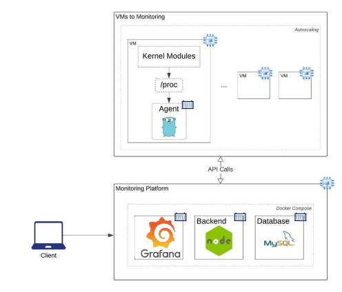

# Plataforma de Monitoreo en GCP

En este proyecto, se tiene como objetivo principal implementar un sistema de monitoreo de recursos del
sistema y gestión de procesos, empleando varias tecnologías y lenguajes de programación. El sistema
resultante permitirá obtener información clave sobre el rendimiento del computador, procesos en
ejecución y su administración a través de una interfaz amigable. Para el despliegue del proyecto se
utilizará GCP Compute Engine y autoscaling para simular múltiples máquinas virtuales a monitorear.

## Objetivos

- Conocer el Kernel de Linux mediante módulos de C.
- Hacer uso de programación asíncrona con rutinas de Golang.
- Comprender el funcionamiento de los contenedores usando Docker.
- Utilizar GCP Compute Engine y autoscaling.

## Manual Técnico

### Google Cloud Platform

Google Cloud Platform (GCP) es una plataforma de computación en la nube que ofrece una amplia gama de servicios y herramientas para desarrollar, implementar y gestionar aplicaciones y servicios en la nube. GCP proporciona una infraestructura escalable y segura para almacenar y procesar datos, ejecutar aplicaciones y servicios, y conectar con usuarios y dispositivos.

### Instancia

Una instancia en GCP es una máquina virtual (VM) que se ejecuta en la infraestructura de Google Cloud. Las instancias pueden ser personalizadas con diferentes configuraciones de hardware y software, y se pueden utilizar para una variedad de tareas, como servidores web, bases de datos, aplicaciones y servicios. Las instancias pueden ser creadas y eliminadas según sea necesario, lo que permite una gran flexibilidad y escalabilidad.

### Grupo de Instancias

Grupos de instancias Un grupo de instancias en GCP es un conjunto de instancias que se gestionan juntas como una unidad. Los grupos de instancias pueden ser utilizados para implementar aplicaciones y servicios que requieren múltiples instancias, y pueden ser configurados para escalar automáticamente según la demanda. Los grupos de instancias también pueden ser utilizados para implementar balanceadores de carga, lo que permite distribuir el tráfico entre varias instancias y mejorar la disponibilidad y el rendimiento de las aplicaciones.

### Utilización

- Se utiliza una instancia de máquina virtual para poder almacenar el frontend con grafana, la api con NodeJs y la base de datos, todo eso con un docker compose.
- Se utiliza un grupo de instancias para poder crear varias máquinas virtuales y que estás puedan enviar sus datos para poder ser monitoreadas.

### Arquitecruta

### Grafana

Grafana se utiliza para poder mostrar gráficas del uso de memoria y cpu del grupo de instancias, también se mostrará una tabla con los procesos activos de cada instancia como la gráfica a traves del tiempo del uso de cpu y ram para ver como a sido su comportamiento.

### Módulos

Los módulos son programas escritos en C que obtienen los datos de uso de cpu y ram de las librerías del sistema operativo y crear un proceso para que este ejecute constantemente.

### Agent

El agente es un programa escrito en Go el cual lee los archivos creados por los módulos y envía estos datos a la api para su posterior procesamiento.

### Api

La api está hecha con NodeJS, está recibe los datos del grupo de instancias y los almacena en la base de datos.

### Base de datos

La base de datos es creada en MySQL, utiliza 3 tablas una para los datos de la RAM, otra para los datos de uso de CPU y la tercera es para almacenar los procesos activos.
